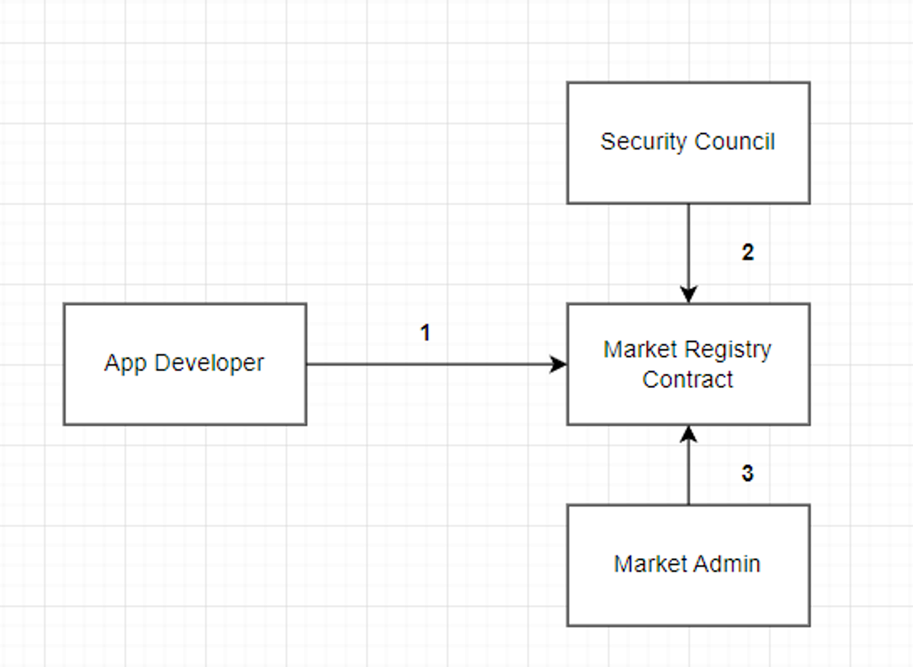
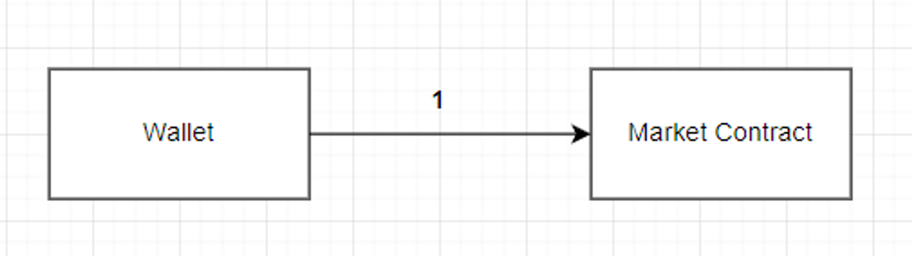
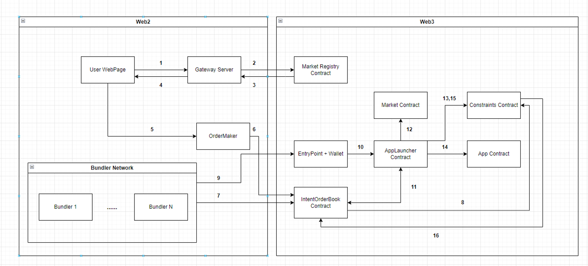

# Intent Market POC
** This POC demo built based on the ZeroDev Kernel.


## Introduction
Until now, many wallets, including Metamask, have emerged, and users have utilized these wallets to participate in the Blockchain ecosystem.

However, users had no choice but to passively accept the features proposed by the wallet companies within the UI provided by these companies.

For instance, if Wallet Company A has incorporated a Token swap feature in their wallet product but lacks a bridge function to transfer to another chain, users have to passively wait until Company A develops this bridge function.

If Company A prioritizes other tasks and allocates most of their resources to those tasks, users needing the bridge function are left waiting indefinitely.

It's not feasible to expect Company A to hire additional staff specifically to develop this bridge function.

This proposal aims to address these challenges by integrating third parties into wallets that follow the ERC-4337 standard.

The idea's concept is similar to Apple's App Store or Google's Play Store, where Intent Applications are deployed for general users.

Each Intent Application is assumed to provide Metadata to render a UI for users to specify their Intents and to undertake optimized actions depending on the type of the user's Intent.

By involving third parties in wallet functionality development, it's possible to avoid the inability to quickly offer a better User Experience due to the limitations of a specific company's manpower and resources.

In a past conversation with me, ZeroDev CEO Derek pondered how to ensure the Best Execution for handling general Intents, not specialized ones like the swap-focused Intent of UniswapX.

This proposal presents a potential solution to such considerations.

## Terms
**Intent Application** → Refers to an Application that executes a user's Intent. Examples include Cowswap and Uniswap.

**Security Council** → An entity designated by the Market Admin. Its primary function is to review and verify that the Intent Applications listed in the Market can execute specific Intents of users. Furthermore, it ensures these applications do not engage in malicious actions, such as misappropriating users' assets. It is the role of Audit Firms.

## Intent Application Deployment Process

1. To deploy an Intent Application, the Application Developer registers the following data with the Market Registry. After completion of the upload, a unique Application ID is issued.
```solidity
struct AppData {
        string appName; // Application Name
        address appAddr; // App Contract Address
        address checkAddr; // Constraints Contract Address
        address prerequisiteAddr; // Prerequisite Contract Address
        string conditionJson; // UI Metadata
        address creator; // App Developer
        address wannaSecurityCouncil; // Security Council where an App Developer wishes to have their app reviewed.
        uint8 securityCouncilPass; // Whether passed by the Security Council
        uint8 finalPass; // Whether passed by the Market Admin
        uint8 payFlag; // Whether to make it available for a fee or free of charge
				// assetCount(uint8) | assetType(uint8) | extra calldata related with asset(bytes) | ...
        bytes prevAction;
				// Assuming the app is used for a fee, the decision on which coin to use for payment.
        address paymentCurrency;
				// The payment amount assuming the app is used for a fee.
        uint128 price;
				// App usage duration upon payment
        uint48 usePeriod;
				string description;

				// The App Developer permits the Bundler that launches the App using a Whitelist.
        address[] whitelistBundler;
}
```
2. Based on the AppData registered in the Market Registry, the Security Council examines whether the App Contract of the Intent Application conforms to the pre-registered Description in terms of functionality. They also verify if there are any malicious activities and ensure that the Constraints Contract, which checks the proper execution of the Intent, operates correctly.
3. Upon determining that the Intent Application is legitimate and poses no harm to users, the Security Council grants approval. Subsequently, the Market Admin grants the final approval, allowing the Intent Application to be made public on the Market for users to access.

## Intent Application Subscribe

1. In the on-chain, if a Wallet (user) wishes to utilize a specific Intent Application, they can convey their desired Intent Application's ID via the Market Contract and subsequently subscribe. If the Application Developer has predetermined a fee for usage, based on the information registered in the Market Registry Contract, the user must pay the designated amount for a subscription to be created. After the subscription is finalized, the user can access the Intent Application through the AppLauncher Contract.

## Execution Flow


1. The User Webpage retrieves the Market ID of the desired Intent Application to execute from the Gateway Server.
2. The Gateway Server makes a request for information related to the App by calling the getAppMetadata function from the Market Registry Contract.
3. The Market Registry Contract returns the information related to the App to the Gateway Server.
4. The Gateway Server conveys the results received from the Market Registry Contract to the user's webpage. Based on the received information, the user's webpage renders the UI.
    - Let's consider an Intent Application that aims for optimal swaps, similar to Uniswap X, as an example.
    - Based on the UI Metadata uploaded to the Market Registry Contract by the Application Developer, the webpage renders input fields that materialize the user's intent. In the just-mentioned example, the type of asset to be swapped, the quantity, the type of asset to receive, and the execution time could be the input fields.
5. Based on the UI Metadata, input fields are rendered on the user's webpage. Signed two UserOperations are generated based on the values entered into these input fields. Subsequently, this is sent to OrderMaker along with the extradata.
    - The UserOperation sent by OrderMaker consists of two parts.
      The first UserOperation executes the run function of the Prerequisite Contract using delegatecall. The input received from the user's webpage is given as a parameter to the run function of the Prerequisite Contract.
    - The second UserOperation calls the run function of the App Contract through the App Launcher Contract. The input received from the user's webpage is provided as a parameter to the run function of the App Contract.
    - The extradata includes the Order's **`closeTime`**, which signifies the point in time when the executor of the Order is determined in the IntentOrderBook Contract.
6. The OrderMaker, having received the two UserOperations mentioned in step 5, consolidates the UserOperation and extradata into a single `Order` and uploads it to the IntentOrderBook contract.
7. Bundlers intending to execute an Order posted on the IntentOrderBook Contract convey their intention to do so to the IntentOrderBook contract via a transaction.
    - Within the transaction in which the Bundler conveys their intention to the IntentOrderBook Contract, as mentioned in step 7, parameters required for the Constraints Contract to score the Order submitted by the Bundler are included. These parameters are later used by the Constraints Contract to check if the conditions presented by the Bundler were adhered to after executing the Application. If not met, a penalty is applied.
    - If the Application Developer of the Bundler's targeted Order has not specifically designated a "whitelistbundler" in the Market Registry Contract, then all Bundlers can participate in the Order competition. However, if they have designated one, only the Bundlers included in the "whitelistbundler" can participate in the Order competition.
        - Why use this logic?
            - Let's take the Swap Application, for example.
            - To explain the reason for introducing this logic, let's use a Swap-performing Intent Application as an example. Suppose there's a reputable Bundler known for always delivering the best results every time a Swap is performed. This Bundler, leveraging its positive reputation, could create a paid Application and set it up in the Market Registry Contract to be offered as a premium service. By doing so, the Bundler could sell the app to their fans, securing an additional income stream. If one capitalizes on their reputation to attract users to a paid application, it's likely that many competing applications with similar functions will emerge. This will lead to competition among premium applications, and the application that guarantees the best results will win this contest. As a result, from a user's perspective, an additional option emerges to guarantee the best execution for general intents, aside from the Order Matching Competition.
    - If a Bundler wishes to participate in the Order Matching Competition via the IntentOrderBook Contract, they must deposit a security deposit into the IntentOrderBook Contract.
    - The reason for requiring a deposit is to prevent situations where a Bundler, despite winning the Order Matching Competition, deliberately does not execute the UserOperations included in the Order.
    - If it's confirmed that a Bundler, who won the Order Matching Competition and was selected as the Executor, does not execute the UserOperations contained in the Order, a portion of their deposited security will be slashed.
    - After depositing the security, there's a mandatory waiting period before one can withdraw it.
    - Additionally, there is a separate monitor in place; if it's determined that a Bundler has engaged in any form of misconduct, a portion of their security deposit will be slashed.
8. The IntentOrderBook Contract invokes the Score function of the Constraints Contract using parameters received from the Bundler that are used for Scoring. The Score function of the Constraints Contract calculates and returns the Bundler's score to the IntentOrderBook Contract.
    - Best execution is divided into two types:
        - First best execution type is when the UserOperation is executed as quickly as possible.
            - For this type, the Constraints Contract returns the same value to all Order Candidates without any special calculations.
            - If all Executor Candidates have the same Score in the IntentOrderBook Contract, the Contract ranks them based on which Executor Candidate was created first. The IntentOrderBook Contract then designates the earliest uploaded Order Candidate as the Order and completes the Order Matching.
        - Second best execution is when it ensures the maximum economic profit for the user.
            - The Constraints Contract calculates the score for the Order Candidate using the parameters passed to the IntentOrderBook Contract.
            - The Executor Candidate with the highest score is confirmed as the Executor once the CloseTime of the Order has passed.
            - To illustrate with a swap as an example, when the Application Developer scores the Executor Candidate in the Constraints Contract, the Swap Input Amount and Swap Output Amount would likely be available parameters. How the score is calculated is at the discretion of the Application Developer.
9. Once the closeTime of the Order registered in the IntentOrderBook Contract has passed, the Bundler selected as the Executor runs the two UserOperations included in the Order through the EntryPoint. (Prerequisite UserOperation, Main UserOperation)
    - The Bundler selected as the executor can place their transaction both before and after executing the UserOperation.
10. Among the two UserOperations included in the Order, the first UserOperation invokes the Run function of the Prerequisite Contract using DelegateCall from the Wallet Contract, via the 4337 EntryPoint Contract. After the completion of the first UserOperation's call, the second UserOperation calls the AppLauncher Contract from the Wallet Contract through the 4337 EntryPoint Contract.
11. The AppLauncher Contract checks if the tx.origin (Bundler) is authorized as the Executor to execute the received UserOperation and retrieves the parameters that the Bundler has promised to execute from the IntentOrderBook Contract.
12. The AppLauncher Contract interacts with the Market Contract to verify if the Wallet owner is currently subscribed to the desired Application Contract and whether the subscription period has not yet expired.
13. The AppLauncher Contract invokes the getPrevState function from the Constraints Contract to retrieve the state prior to the execution of the application.
14. The main functionality of the App Contract is called from within the AppLauncher Contract. For example, in the case of a Swap Application, this is where the actual swap operation takes place.
15. After the primary function of the App Contract has been called, the check function of the Constraints Contract is invoked to compare the state before and after the call to ensure the user's minimum requirements are met. If these are not satisfied, the transaction is reverted. This step is not about ensuring the best execution, but rather verifying that the user intent's basic conditions are met.
16. In step 11, the retrieved parameters are compared with the state after the execution of the Application to verify whether the Executor has fulfilled the conditions they submitted during the Order Matching Competition in the IntentOrderBook Contract. If these conditions are not met, the transaction is reverted. Observers who witness this revert will slash from the Executor's security deposit. Step 16 exists specifically to ensure the best execution.